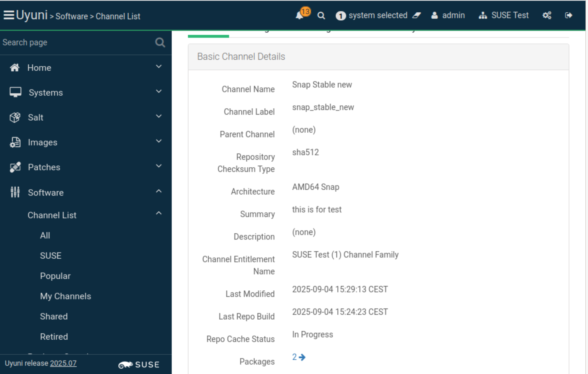
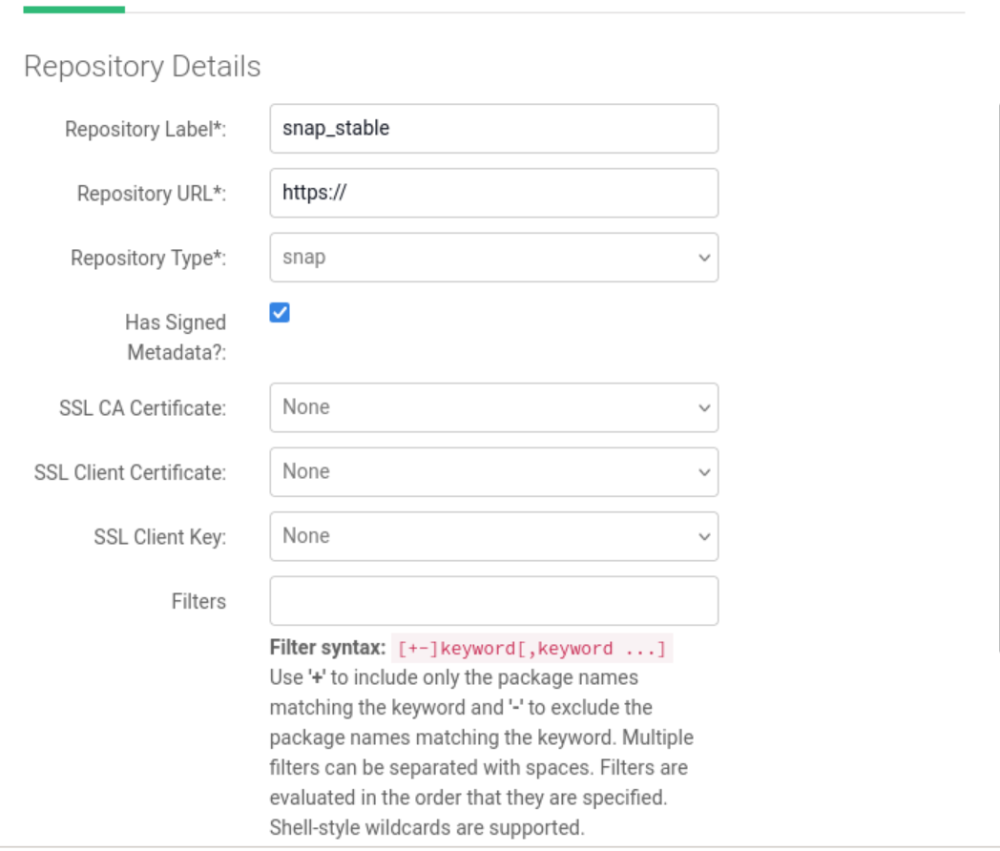
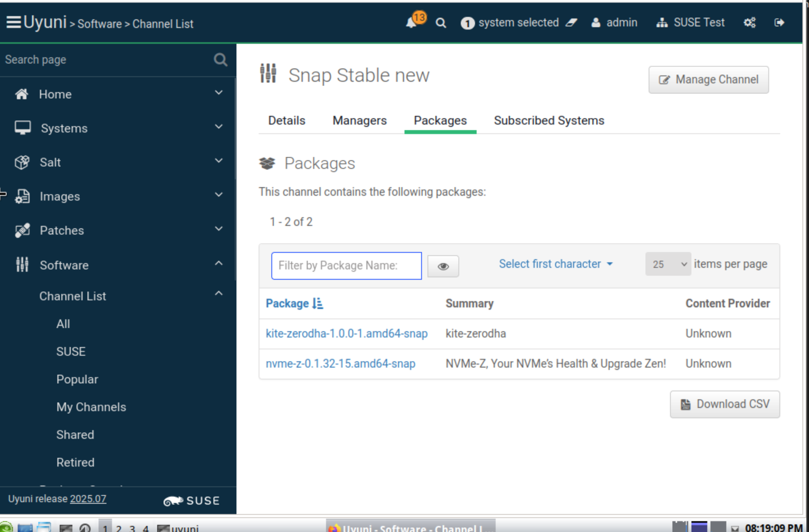

# GSoC-openSUSE-Uyuni-Support-for-Ubuntu-Snap-Packages-in-Uyuni
# Support for Ubuntu Snap Packages in Uyuni
## Project background 
### About uyuni 

Uyuni is a configuration and infrastructure management tool that provides automated patch and package management, saving time and effort when managing a large number of machines.

Uyuni supports various package formats. For Ubuntu and Debian, it manages .deb packages. For distributions like openSUSE, SUSE, RHEL, Fedora, and CentOS, it handles yum and rpm based packages.

Uyuni uses Salt, a powerful configuration management system, for centralized control. The Uyuni master acts as a Salt master, using Salt states and modules for remote management of client systems.

### Introducing Snap Packages

Snap is a modern, trending package format provided by Canonical's Snapcraft. Its key advantage lies in its self-contained nature.

Snap packages run in isolated sandboxes, which prevents "dependency hell"—a common problem where different applications require conflicting library versions.

Since snap is more and more popular and easy to use, we want introduce snap packages in uyuni 

## Challenge :

Unlike APT/DEB repositories, which expose public, signed metadata indexes (like Release, InRelease, and Packages) at a single base URL, the Snap package ecosystem is not entirely open source. This allows the complete package list to be fetched over plain HTTP.

However, Snaps are distributed via the centralized Snap Store. Its server-side APIs are not publicly documented for bulk operations, and there is no simple, mirrorable endpoint to "list all packages at a URL."

Furthermore, a .snap binary must be accompanied by an assertion chain so that snapd can verify its authenticity.

For offline installations, you need, at a minimum, the snap-revision assertion. The device must also have supporting assertions stored locally, including the account-key, account, snap-revision, and snap-declaration.

## Implement PR

- [RFC - uyuni support snap](https://github.com/uyuni-project/uyuni-rfc/pull/107)

- [Snap plugin implementation](https://github.com/uyuni-project/uyuni/pull/10527)

- [Sync Snap channels](https://github.com/uyuni-project/uyuni/pull/10840)

## Deliverables

### Design and write the RFC for supporting Ubuntu Snap packages in Uyuni
#### investigate multiple methods to enable Uyuni to support Snap:

1. [Explore the Snap install method and the mock API method.](./doc/methods-to-support-snap-sync.md)

2. [Explore using a Snap Store Proxy (from Canonical) to introduce Snap packages into Uyuni.](./doc/methods-to-support-snap-sync.md)

3. [Use Salt to provide Snap support.](./doc/use-salt-to-provide-snap-support.md)

### Enable creation of Snap channels in Uyuni.

### Enable creation of Snap repositories in Uyuni.

### Extend the command line:
spacewalk-repo-sync -c <channel-label> -t snap
to synchronize the channel by:

1. Fetching Snap information from Snapcraft.

2. Downloading Snap binary files into the local repository.

3. Reading metadata from the binary files.

4. Saving the metadata in the rhnPackage table and related reference tables in the database.

5. Display the list of Snap package names on the web page.

# Future work
The work can mainly be divided into two parts:

The first part is syncing the Snap channel, which has already been completed.

The second part is implementing the Salt module and Salt state for the Salt master, which will be the focus of future coding work.
